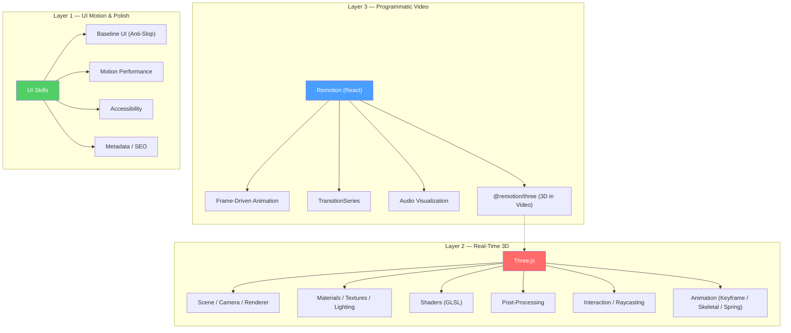
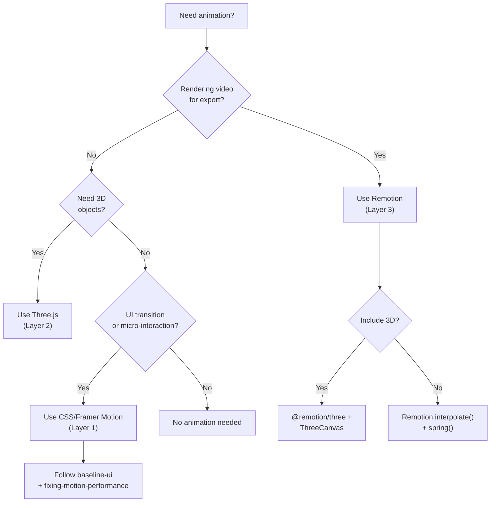

# 🎬 Motion & Animation Master Guide: Unified Best Practices

> **Synthesized from 25+ agent skills** across `threejs-skills`, `skills/remotion`, and `ui-skills` repositories.
> Covers 3D graphics (Three.js), programmatic video (Remotion), UI motion performance, accessibility, metadata, and quality assurance.

---

## 1. Executive Summary

This guide unifies best practices from three distinct animation/motion repositories into a **single, authoritative reference** for modern web animation and motion graphics development.

### Sources Analyzed

| Repository | Skills | Focus |
|---|---|---|
| `threejs-skills` | 10 SKILL.md files | Real-time 3D graphics with Three.js |
| `skills/remotion` | 27 sub-rule files | Programmatic React video creation |
| `ui-skills` | 4 SKILL.md files | UI polish, a11y, SEO metadata, motion performance |

### Key Philosophies

1. **Compositor-First Animation** — Animate only `transform` and `opacity`; never animate layout properties (`width`, `height`, `margin`, `top`, `left`).
2. **Frame-Driven Determinism** — In Remotion, all motion is driven by `useCurrentFrame()`. CSS animations and `useFrame()` are **forbidden**.
3. **Performance Budget Awareness** — Every animation has a rendering cost. Default to the cheapest rendering path (composite → paint → layout).
4. **Accessibility by Default** — Respect `prefers-reduced-motion`, provide keyboard equivalents for hover interactions, and ensure all interactive elements have accessible names.
5. **Spring Physics over Linear Easing** — Prefer spring-based / ease-out curves for natural, organic motion. Reserve linear for progress indicators only.

---

## 2. Architecture & Design Patterns

### 2.1 Conceptual Architecture

The three repositories map to distinct layers of a modern motion-graphics stack:



### 2.2 Decision Tree — Which Layer to Use?



### 2.3 Golden Rules (Cross-Cutting)

| # | Rule | Source |
|---|---|---|
| 1 | Animate only `transform` and `opacity` for UI motion | `baseline-ui`, `fixing-motion-performance` |
| 2 | All Remotion animation must be driven by `useCurrentFrame()` | `remotion/animations` |
| 3 | Never use `useFrame()` from R3F inside Remotion | `remotion/3d` |
| 4 | Dispose textures, materials, and geometries when done | `threejs-textures`, `threejs-materials` |
| 5 | Use spring physics for natural motion, not linear easing | `remotion/timing`, `baseline-ui` |
| 6 | Respect `prefers-reduced-motion` for non-essential motion | `baseline-ui`, `fixing-accessibility` |
| 7 | Never animate layout properties continuously on large surfaces | `fixing-motion-performance` |
| 8 | Use power-of-2 texture dimensions (256, 512, 1024, 2048) | `threejs-textures` |
| 9 | Profile GPU usage; limit post-processing passes | `threejs-postprocessing` |
| 10 | Batch DOM reads before writes (FLIP pattern) | `fixing-motion-performance` |

---

## 3. Core Capabilities & Implementation

### 3.1 Three.js — Real-Time 3D Graphics

#### 3.1.1 Scene Setup (Fundamentals)

Every Three.js application requires three core objects:

```javascript
import * as THREE from 'three';

// 1. Scene — container for all objects
const scene = new THREE.Scene();

// 2. Camera — perspective view
const camera = new THREE.PerspectiveCamera(
  75,                                    // FOV
  window.innerWidth / window.innerHeight, // Aspect
  0.1,                                   // Near clipping
  1000                                   // Far clipping
);
camera.position.set(0, 5, 10);
camera.lookAt(0, 0, 0);

// 3. Renderer — WebGL output
const renderer = new THREE.WebGLRenderer({ antialias: true });
renderer.setSize(window.innerWidth, window.innerHeight);
renderer.setPixelRatio(Math.min(window.devicePixelRatio, 2));
renderer.shadowMap.enabled = true;
renderer.shadowMap.type = THREE.PCFSoftShadowMap;
renderer.outputColorSpace = THREE.SRGBColorSpace;
renderer.toneMapping = THREE.ACESFilmicToneMapping;
renderer.toneMappingExposure = 1.0;
document.body.appendChild(renderer.domElement);

// 4. Animation Loop
const clock = new THREE.Clock();
function animate() {
  requestAnimationFrame(animate);
  const delta = clock.getDelta();
  // Update animations, controls, etc.
  renderer.render(scene, camera);
}
animate();

// 5. Resize Handler
window.addEventListener('resize', () => {
  camera.aspect = window.innerWidth / window.innerHeight;
  camera.updateProjectionMatrix();
  renderer.setSize(window.innerWidth, window.innerHeight);
});
```

#### 3.1.2 Materials & PBR Textures

Three.js supports a full PBR (Physically-Based Rendering) pipeline:

```javascript
// Load full PBR texture set
const loader = new THREE.TextureLoader();
const [color, normal, roughness, metalness, ao] = await Promise.all([
  loadTexture('color.jpg'),
  loadTexture('normal.jpg'),
  loadTexture('roughness.jpg'),
  loadTexture('metalness.jpg'),
  loadTexture('ao.jpg'),
]);

// CRITICAL: Color space for accurate rendering
color.colorSpace = THREE.SRGBColorSpace;
// Data textures (normal, roughness, metalness, AO) stay LINEAR (default)

const material = new THREE.MeshStandardMaterial({
  map: color,
  normalMap: normal,
  normalScale: new THREE.Vector2(1, 1),
  roughnessMap: roughness,
  roughness: 1,
  metalnessMap: metalness,
  metalness: 1,
  aoMap: ao,
  aoMapIntensity: 1,
});

// Required for AO map
geometry.setAttribute('uv2', geometry.attributes.uv);
```

**Material Selection Guide:**

| Material | Use Case | Cost |
|---|---|---|
| `MeshBasicMaterial` | Unlit, UI overlays, wireframes | Cheapest |
| `MeshLambertMaterial` | Non-shiny surfaces, performance-critical | Low |
| `MeshPhongMaterial` | Shiny surfaces with specular highlights | Medium |
| `MeshStandardMaterial` | PBR — **default choice** | Medium-High |
| `MeshPhysicalMaterial` | Clearcoat, transmission, iridescence | Highest |
| `ShaderMaterial` | Custom GLSL effects | Variable |

#### 3.1.3 Lighting & Shadows

```javascript
// Three-Point Lighting Setup
const ambient = new THREE.AmbientLight(0x404040, 0.5);
scene.add(ambient);

const key = new THREE.DirectionalLight(0xffffff, 1.0);
key.position.set(5, 10, 7);
key.castShadow = true;
key.shadow.mapSize.set(2048, 2048);
key.shadow.camera.near = 0.5;
key.shadow.camera.far = 50;
key.shadow.bias = -0.0001;
scene.add(key);

const fill = new THREE.DirectionalLight(0x8888ff, 0.3);
fill.position.set(-5, 5, -5);
scene.add(fill);

const rim = new THREE.PointLight(0xffaa00, 0.5, 50);
rim.position.set(0, 5, -10);
scene.add(rim);

// IBL (Image-Based Lighting) — the gold standard
import { RGBELoader } from 'three/addons/loaders/RGBELoader.js';
const pmrem = new THREE.PMREMGenerator(renderer);
new RGBELoader().load('environment.hdr', (texture) => {
  const envMap = pmrem.fromEquirectangular(texture).texture;
  scene.environment = envMap;
  scene.background = envMap;
  texture.dispose();
  pmrem.dispose();
});
```

#### 3.1.4 Animation System

Three.js provides a complete keyframe animation system:

```javascript
import { GLTFLoader } from 'three/addons/loaders/GLTFLoader.js';

const loader = new GLTFLoader();
loader.load('character.glb', (gltf) => {
  const model = gltf.scene;
  scene.add(model);

  // Enable shadows on all meshes
  model.traverse((child) => {
    if (child.isMesh) {
      child.castShadow = true;
      child.receiveShadow = true;
    }
  });

  // Animation Mixer
  const mixer = new THREE.AnimationMixer(model);
  const clips = gltf.animations;

  // Play all clips
  clips.forEach((clip) => mixer.clipAction(clip).play());

  // Or crossfade between actions
  const idle = mixer.clipAction(clips[0]);
  const walk = mixer.clipAction(clips[1]);
  idle.play();

  function crossfadeTo(newAction, duration = 0.5) {
    newAction.reset().setEffectiveTimeScale(1).setEffectiveWeight(1).play();
    idle.crossFadeTo(newAction, duration, true);
  }

  // Update in animation loop
  function animate() {
    const delta = clock.getDelta();
    mixer.update(delta);
    renderer.render(scene, camera);
    requestAnimationFrame(animate);
  }
  animate();
});
```

#### 3.1.5 Custom Shaders (GLSL)

```javascript
const material = new THREE.ShaderMaterial({
  uniforms: {
    time: { value: 0 },
    color: { value: new THREE.Color(0x4a9eff) },
    map: { value: texture },
  },
  vertexShader: `
    uniform float time;
    varying vec2 vUv;
    varying vec3 vNormal;

    void main() {
      vUv = uv;
      vNormal = normalize(normalMatrix * normal);

      // Wave displacement
      vec3 pos = position;
      pos.z += sin(pos.x * 5.0 + time) * 0.2;

      gl_Position = projectionMatrix * modelViewMatrix * vec4(pos, 1.0);
    }
  `,
  fragmentShader: `
    uniform vec3 color;
    uniform sampler2D map;
    varying vec2 vUv;
    varying vec3 vNormal;

    void main() {
      vec4 texColor = texture2D(map, vUv);

      // Fresnel rim glow
      vec3 viewDir = normalize(cameraPosition - vNormal);
      float fresnel = pow(1.0 - dot(viewDir, vNormal), 3.0);

      gl_FragColor = vec4(mix(texColor.rgb, color, fresnel), 1.0);
    }
  `,
});

// Update in animation loop
material.uniforms.time.value = clock.getElapsedTime();
```

**Shader Performance Rules:**
1. Minimize uniforms — group related values into vectors
2. Avoid conditionals — use `mix()` / `step()` instead of `if/else`
3. Precalculate in JS when possible
4. Use texture lookup tables for complex math functions

#### 3.1.6 Post-Processing Pipeline

```javascript
import { EffectComposer } from 'three/addons/postprocessing/EffectComposer.js';
import { RenderPass } from 'three/addons/postprocessing/RenderPass.js';
import { UnrealBloomPass } from 'three/addons/postprocessing/UnrealBloomPass.js';
import { ShaderPass } from 'three/addons/postprocessing/ShaderPass.js';
import { FXAAShader } from 'three/addons/shaders/FXAAShader.js';
import { VignetteShader } from 'three/addons/shaders/VignetteShader.js';

const composer = new EffectComposer(renderer);

// 1. Scene render
composer.addPass(new RenderPass(scene, camera));

// 2. Bloom (glow effect)
const bloom = new UnrealBloomPass(
  new THREE.Vector2(window.innerWidth, window.innerHeight),
  0.5, 0.4, 0.85 // strength, radius, threshold
);
composer.addPass(bloom);

// 3. Vignette
const vignette = new ShaderPass(VignetteShader);
vignette.uniforms['offset'].value = 0.95;
vignette.uniforms['darkness'].value = 1.0;
composer.addPass(vignette);

// 4. Anti-aliasing (always last)
const fxaa = new ShaderPass(FXAAShader);
fxaa.uniforms['resolution'].value.set(
  1 / window.innerWidth, 1 / window.innerHeight
);
composer.addPass(fxaa);

// Use composer.render() instead of renderer.render()
function animate() {
  requestAnimationFrame(animate);
  composer.render();
}
```

**Post-Processing Pass Order:**
1. `RenderPass` (scene) → 2. SSAO → 3. Bloom → 4. Color Correction → 5. Vignette → 6. Gamma → 7. FXAA (always last)

#### 3.1.7 Interaction & Raycasting

```javascript
import { OrbitControls } from 'three/addons/controls/OrbitControls.js';

// Camera controls with damping
const controls = new OrbitControls(camera, renderer.domElement);
controls.enableDamping = true;
controls.dampingFactor = 0.05;
controls.minDistance = 2;
controls.maxDistance = 50;

// Raycasting for click detection
const raycaster = new THREE.Raycaster();
const mouse = new THREE.Vector2();

function onClick(event) {
  const rect = renderer.domElement.getBoundingClientRect();
  mouse.x = ((event.clientX - rect.left) / rect.width) * 2 - 1;
  mouse.y = -((event.clientY - rect.top) / rect.height) * 2 + 1;

  raycaster.setFromCamera(mouse, camera);
  const intersects = raycaster.intersectObjects(clickables, true);

  if (intersects.length > 0) {
    const hit = intersects[0];
    console.log('Hit:', hit.object.name, 'at', hit.point);
  }
}

renderer.domElement.addEventListener('click', onClick);

// Performance: throttle mousemove raycasts
let lastRaycast = 0;
function onMouseMove(event) {
  if (Date.now() - lastRaycast < 50) return; // 20fps max
  lastRaycast = Date.now();
  // ... raycast logic
}
```

---

### 3.2 Remotion — Programmatic React Video

#### 3.2.1 Composition Setup

```tsx
import { Composition, Folder } from 'remotion';
import { MyVideo, type MyVideoProps } from './MyVideo';

export const RemotionRoot = () => (
  <Folder name="Marketing">
    <Composition
      id="PromoVideo"
      component={MyVideo}
      durationInFrames={300}  // 10 seconds at 30fps
      fps={30}
      width={1920}
      height={1080}
      defaultProps={{
        title: 'Hello World',
        accentColor: '#4a9eff',
      } satisfies MyVideoProps}
    />
  </Folder>
);
```

#### 3.2.2 Frame-Driven Animation (The Core Principle)

> **CRITICAL:** All Remotion animations MUST be driven by `useCurrentFrame()`. CSS transitions, Tailwind animation classes, and `useFrame()` from R3F are **FORBIDDEN** — they cause flickering during rendering.

```tsx
import {
  useCurrentFrame,
  useVideoConfig,
  interpolate,
  spring,
  Easing,
} from 'remotion';

export const AnimatedTitle = () => {
  const frame = useCurrentFrame();
  const { fps, durationInFrames } = useVideoConfig();

  // Spring entrance (natural bounce)
  const entranceProgress = spring({
    frame,
    fps,
    config: { damping: 200 }, // Smooth, no bounce
  });

  // Map spring (0→1) to custom ranges
  const translateY = interpolate(entranceProgress, [0, 1], [50, 0]);
  const opacity = entranceProgress;

  // Exit animation
  const exitProgress = spring({
    frame,
    fps,
    delay: durationInFrames - fps, // Start 1 second before end
    config: { damping: 200 },
  });

  const scale = 1 - exitProgress * 0.5;

  return (
    <div
      style={{
        transform: `translateY(${translateY}px) scale(${scale})`,
        opacity,
        fontFamily: 'Inter, sans-serif',
        fontSize: 72,
        fontWeight: 700,
        color: '#fff',
      }}
    >
      Hello World
    </div>
  );
};
```

**Spring Presets:**

| Config | Behavior | Use Case |
|---|---|---|
| `{ damping: 200 }` | Smooth, no bounce | Subtle reveals, text |
| `{ damping: 20, stiffness: 200 }` | Snappy, minimal bounce | UI elements |
| `{ damping: 8 }` | Bouncy entrance | Playful animations |
| `{ damping: 15, stiffness: 80, mass: 2 }` | Heavy, slow | Dramatic effects |

#### 3.2.3 Sequencing & Transitions

```tsx
import { Series, Sequence, AbsoluteFill } from 'remotion';
import { TransitionSeries, linearTiming, springTiming } from '@remotion/transitions';
import { fade } from '@remotion/transitions/fade';
import { slide } from '@remotion/transitions/slide';

// Simple sequential playback
const SequentialVideo = () => {
  const { fps } = useVideoConfig();

  return (
    <Series>
      <Series.Sequence durationInFrames={3 * fps}>
        <Intro />
      </Series.Sequence>
      <Series.Sequence durationInFrames={5 * fps}>
        <MainContent />
      </Series.Sequence>
      <Series.Sequence durationInFrames={2 * fps}>
        <Outro />
      </Series.Sequence>
    </Series>
  );
};

// With transitions (scenes overlap during transition)
const TransitionVideo = () => {
  const { fps } = useVideoConfig();

  return (
    <TransitionSeries>
      <TransitionSeries.Sequence durationInFrames={3 * fps}>
        <SceneA />
      </TransitionSeries.Sequence>
      <TransitionSeries.Transition
        presentation={fade()}
        timing={springTiming({ config: { damping: 200 } })}
      />
      <TransitionSeries.Sequence durationInFrames={5 * fps}>
        <SceneB />
      </TransitionSeries.Sequence>
      <TransitionSeries.Transition
        presentation={slide({ direction: 'from-left' })}
        timing={linearTiming({ durationInFrames: 20 })}
      />
      <TransitionSeries.Sequence durationInFrames={3 * fps}>
        <SceneC />
      </TransitionSeries.Sequence>
    </TransitionSeries>
  );
};
```

> **Duration math:** Transitions shorten the timeline. With two 60-frame scenes and a 15-frame transition: `60 + 60 - 15 = 105 frames`.

#### 3.2.4 Audio Visualization

```tsx
import { useWindowedAudioData, visualizeAudio } from '@remotion/media-utils';
import { staticFile, useCurrentFrame, useVideoConfig, spring } from 'remotion';

const SpectrumBars = () => {
  const frame = useCurrentFrame();
  const { fps } = useVideoConfig();

  const { audioData, dataOffsetInSeconds } = useWindowedAudioData({
    src: staticFile('music.mp3'),
    frame,
    fps,
    windowInSeconds: 30,
  });

  if (!audioData) return null;

  const frequencies = visualizeAudio({
    fps, frame, audioData,
    numberOfSamples: 256,       // Must be power of 2
    optimizeFor: 'speed',
    dataOffsetInSeconds,
  });

  // Bass-reactive effect: average low frequencies
  const bass = frequencies.slice(0, 32);
  const bassIntensity = bass.reduce((sum, v) => sum + v, 0) / bass.length;
  const pulseScale = 1 + bassIntensity * 0.3;

  return (
    <div style={{ display: 'flex', alignItems: 'flex-end', height: 300 }}>
      {frequencies.map((v, i) => (
        <div
          key={i}
          style={{
            flex: 1,
            height: `${v * 100}%`,
            backgroundColor: `hsl(${210 + i * 0.5}, 80%, 60%)`,
            margin: '0 1px',
            borderRadius: '4px 4px 0 0',
            transform: `scaleY(${pulseScale})`,
          }}
        />
      ))}
    </div>
  );
};
```

#### 3.2.5 3D in Remotion (Three.js + React Three Fiber)

```tsx
import { ThreeCanvas } from '@remotion/three';
import { useCurrentFrame, useVideoConfig, spring, Sequence } from 'remotion';

const Animated3DScene = () => {
  const frame = useCurrentFrame();
  const { width, height, fps } = useVideoConfig();

  const rotationY = frame * 0.02;
  const bounceScale = spring({ frame, fps, config: { damping: 8 } });

  return (
    <ThreeCanvas width={width} height={height}>
      <ambientLight intensity={0.4} />
      <directionalLight position={[5, 5, 5]} intensity={0.8} />

      {/* Sequence MUST use layout="none" inside ThreeCanvas */}
      <Sequence layout="none">
        <mesh
          rotation={[0, rotationY, 0]}
          scale={[bounceScale, bounceScale, bounceScale]}
        >
          <boxGeometry args={[2, 2, 2]} />
          <meshStandardMaterial color="#4a9eff" />
        </mesh>
      </Sequence>
    </ThreeCanvas>
  );
};
```

> **FORBIDDEN in Remotion 3D:** `useFrame()` from `@react-three/fiber`, self-animating shaders, or any animation not driven by `useCurrentFrame()`.

#### 3.2.6 Charts & Data Visualization

```tsx
import { spring, interpolate, Easing, useCurrentFrame, useVideoConfig } from 'remotion';
import { evolvePath } from '@remotion/paths';

// Staggered bar chart entrance
const BarChart = ({ data }: { data: { label: string; value: number }[] }) => {
  const frame = useCurrentFrame();
  const { fps } = useVideoConfig();

  return (
    <div style={{ display: 'flex', alignItems: 'flex-end', gap: 8, height: 300 }}>
      {data.map((item, i) => {
        const height = spring({
          frame,
          fps,
          delay: i * 5, // Stagger
          config: { damping: 200 },
        });
        return (
          <div key={item.label} style={{
            flex: 1,
            height: height * item.value,
            background: '#4a9eff',
            borderRadius: '6px 6px 0 0',
          }} />
        );
      })}
    </div>
  );
};

// Animated SVG line chart
const LineChart = ({ path }: { path: string }) => {
  const frame = useCurrentFrame();
  const { fps } = useVideoConfig();

  const progress = interpolate(frame, [0, 2 * fps], [0, 1], {
    extrapolateLeft: 'clamp',
    extrapolateRight: 'clamp',
    easing: Easing.out(Easing.quad),
  });

  const { strokeDasharray, strokeDashoffset } = evolvePath(progress, path);

  return (
    <svg width={800} height={400}>
      <path
        d={path}
        fill="none"
        stroke="#FF3232"
        strokeWidth={4}
        strokeDasharray={strokeDasharray}
        strokeDashoffset={strokeDashoffset}
      />
    </svg>
  );
};
```

---

### 3.3 UI Motion — Performance & Polish

#### 3.3.1 Motion Performance Rules

From `fixing-motion-performance` — the rendering step glossary:

| Step | Properties | Cost |
|---|---|---|
| **Composite** | `transform`, `opacity` | ✅ Cheapest — GPU only |
| **Paint** | `color`, `border`, `gradient`, `filter`, `mask` | ⚠️ Medium |
| **Layout** | `width`, `height`, `top`, `left`, `margin`, `padding`, `flex`, `grid` | ❌ Most expensive |

**Critical Never-Patterns:**
1. Never interleave DOM reads and writes in the same frame
2. Never animate layout properties continuously on large surfaces
3. Never drive animation from `scrollTop`, `scrollY`, or raw scroll events
4. No `requestAnimationFrame` loops without a stop condition
5. Never mix multiple animation systems that each measure or mutate layout

**Measurement Best Practices (FLIP Pattern):**
1. Measure once, then animate via `transform` or `opacity`
2. Batch all DOM reads before writes
3. Prefer FLIP-style transitions for layout-like effects

**Scroll Animation:**
- Prefer CSS Scroll/View Timelines when available
- Use `IntersectionObserver` for visibility and pausing
- Never poll scroll position for animation
- Pause off-screen animations

**Blur & Filters:**
- Keep blur ≤ 8px, short one-time effects only
- Never animate blur continuously or on large surfaces
- Prefer `opacity` + `translate` before blur

#### 3.3.2 Baseline UI Animation Rules

From `baseline-ui`:

| Rule | Enforcement |
|---|---|
| Animate only `transform` and `opacity` | **MUST** |
| Never animate layout properties | **NEVER** |
| Avoid paint properties except small, local UI | **SHOULD** |
| Use `ease-out` on entrance | **SHOULD** |
| Max `200ms` for interaction feedback | **NEVER exceed** |
| Pause looping animations when off-screen | **MUST** |
| Respect `prefers-reduced-motion` | **SHOULD** |
| Never add animation unless explicitly requested | **NEVER** |
| Never animate large `blur()` or `backdrop-filter` surfaces | **NEVER** |
| Never apply `will-change` outside an active animation | **NEVER** |

**Stack Preferences:**
- **MUST** use `motion/react` (formerly `framer-motion`) for JS animation
- **SHOULD** use `tw-animate-css` for entrance/micro-animations in Tailwind
- **MUST** use `cn` utility (`clsx` + `tailwind-merge`) for class logic

---

## 4. Workflows & Tooling

### 4.1 Three.js Development Workflow

```
1. Set up Scene + Camera + Renderer + Controls
2. Configure lighting (ambient + key + fill, or IBL)
3. Load models (GLTF/GLB with Draco compression)
4. Apply PBR materials (correct color spaces!)
5. Add animation (AnimationMixer / custom)
6. Add post-processing (Bloom → Vignette → FXAA)
7. Implement interaction (Raycasting + Controls)
8. Optimize (dispose, texture pooling, instancing)
9. Handle resize + mobile detection
```

**CLI & Tooling:**
```bash
# Draco decoder path
dracoLoader.setDecoderPath('https://www.gstatic.com/draco/versioned/decoders/1.5.6/');

# KTX2 transcoder path
ktx2Loader.setTranscoderPath('https://cdn.jsdelivr.net/npm/three@0.160.0/examples/jsm/libs/basis/');

# Check GPU memory
console.log(renderer.info.memory);    // Textures, geometries
console.log(renderer.info.render);    // Draw calls, triangles, points
```

### 4.2 Remotion Development Workflow

```
1. Define compositions in Root.tsx (width, height, fps, duration)
2. Build component hierarchy with Sequence/Series
3. Animate with useCurrentFrame() + spring() / interpolate()
4. Add transitions with TransitionSeries
5. Add audio (Audio component, visualizeAudio)
6. Test in Remotion Studio (npx remotion studio)
7. Render (npx remotion render)
```

**CLI Commands:**
```bash
# Install Remotion packages
npx remotion add @remotion/transitions
npx remotion add @remotion/three
npx remotion add @remotion/lottie
npx remotion add @remotion/media-utils
npx remotion add @remotion/paths

# Development
npx remotion studio

# Render
npx remotion render MyComposition out/video.mp4
```

### 4.3 UI Motion Audit Workflow

```
1. Run /fixing-motion-performance <file>
   → Identifies compositor/paint/layout violations
2. Run /baseline-ui <file>
   → Enforces design system constraints
3. Run /fixing-accessibility <file>
   → Checks a11y compliance
4. Run /fixing-metadata <file>
   → Validates SEO metadata
```

Each command outputs:
- **Violations** (exact line/snippet quoted)
- **Why it matters** (one sentence)
- **Concrete fix** (code-level suggestion)

---

## 5. Quality Assurance & Security

### 5.1 Accessibility Checklist

Extracted from `fixing-accessibility` — ordered by **priority**:

| Priority | Category | Impact | Key Rules |
|---|---|---|---|
| 1 | **Accessible Names** | Critical | Every interactive control has a name; icon-only buttons use `aria-label`; links have meaningful text |
| 2 | **Keyboard Access** | Critical | No `div`/`span` as buttons without full keyboard support; all interactive elements reachable by Tab; visible focus |
| 3 | **Focus & Dialogs** | Critical | Modals trap focus; restore focus on close; set initial focus inside dialogs |
| 4 | **Semantics** | High | Prefer native elements (`button`, `a`, `input`); don't skip heading levels |
| 5 | **Forms & Errors** | High | Errors linked via `aria-describedby`; required fields announced; `aria-invalid` on invalid fields |
| 6 | **Announcements** | Medium-High | `aria-live` for critical errors; `aria-busy` for loading; `aria-expanded` for expandable controls |
| 7 | **Contrast & States** | Medium | Sufficient contrast; keyboard equivalents for hover interactions; visible focus outlines |
| 8 | **Media & Motion** | Low-Medium | Correct `alt` text; respect `prefers-reduced-motion`; avoid autoplaying media with sound |

**Key Principle:** Prefer native HTML before adding ARIA. If a role is used, all required ARIA attributes must be present.

### 5.2 Metadata / SEO Checklist

Extracted from `fixing-metadata`:

| Priority | Category | Key Rules |
|---|---|---|
| 1 | **Correctness** | Define metadata in one place per page; no duplicate `<title>`, `<meta>`, or canonical; deterministic values |
| 2 | **Title & Description** | Every page has a title; consistent format across site; meta description for shareable pages |
| 3 | **Canonical & Indexing** | Canonical points to preferred URL; `noindex` only for private/duplicate pages |
| 4 | **Social Cards** | Set OG title, description, image (absolute URLs); `og:url` matches canonical; `twitter:card` set |
| 5 | **Icons & Manifest** | At least one favicon; `apple-touch-icon`; valid `manifest.json`; intentional `theme-color` |
| 6 | **Structured Data** | JSON-LD only when it maps to real page content; no invented ratings/reviews |

### 5.3 Three.js Memory Management

```javascript
// Dispose material and all its textures
function disposeMaterial(material) {
  const maps = [
    'map', 'normalMap', 'roughnessMap', 'metalnessMap',
    'aoMap', 'emissiveMap', 'displacementMap', 'alphaMap',
    'envMap', 'lightMap', 'bumpMap', 'specularMap',
  ];
  maps.forEach((name) => material[name]?.dispose());
  material.dispose();
}

// Dispose entire scene
function disposeScene(scene) {
  scene.traverse((object) => {
    if (object.isMesh) {
      object.geometry.dispose();
      if (Array.isArray(object.material)) {
        object.material.forEach(disposeMaterial);
      } else {
        disposeMaterial(object.material);
      }
    }
  });
}

// Texture pooling for shared textures
class TexturePool {
  constructor() {
    this.textures = new Map();
    this.loader = new THREE.TextureLoader();
  }
  async get(url) {
    if (this.textures.has(url)) return this.textures.get(url);
    const texture = await new Promise((resolve, reject) => {
      this.loader.load(url, resolve, undefined, reject);
    });
    this.textures.set(url, texture);
    return texture;
  }
  disposeAll() {
    this.textures.forEach((t) => t.dispose());
    this.textures.clear();
  }
}
```

### 5.4 Performance Checklists

**Three.js Performance:**
- [ ] Use power-of-2 texture dimensions
- [ ] Compress textures (KTX2/Basis for web)
- [ ] Use texture atlases to reduce switches
- [ ] Use instanced meshes for repeated geometry
- [ ] Enable Draco compression for models
- [ ] Limit post-processing passes
- [ ] Reduce bloom resolution on mobile
- [ ] Cap `pixelRatio` at 2
- [ ] Dispose unused resources
- [ ] Use simpler collision meshes for raycasting

**UI Motion Performance:**
- [ ] Only animate `transform` and `opacity`
- [ ] No `will-change` outside active animation
- [ ] No layout reads inside animation loops
- [ ] Use `IntersectionObserver` for off-screen pausing
- [ ] Throttle mousemove/scroll event handlers
- [ ] Test on mobile devices

---

## 6. "Don't Do This" — Anti-Patterns

### 6.1 Three.js Anti-Patterns

| ❌ Don't | ✅ Do Instead |
|---|---|
| Forget to dispose textures/materials/geometries | Always call `.dispose()` when removing objects |
| Use `colorSpace = SRGBColorSpace` on normal/roughness/AO maps | Only set `SRGBColorSpace` on color/albedo/emissive textures |
| Use non-power-of-2 texture dimensions | Use 256, 512, 1024, 2048 |
| Create new `Vector3`/`Matrix4` objects every frame | Reuse objects with `.set()` / `.copy()` |
| Use `if/else` in GLSL shaders | Use `mix()`, `step()`, `smoothstep()` |
| Apply MSAA + post-processing | Use FXAA/SMAA instead (MSAA doesn't work with EffectComposer) |
| Set `wireframeLinewidth > 1` | WebGL limitation — has no effect on most platforms |
| Raycast every frame without throttling | Throttle to 20fps max for hover effects |

### 6.2 Remotion Anti-Patterns

| ❌ Don't | ✅ Do Instead |
|---|---|
| Use CSS `transition` or `animation` | Use `interpolate()` / `spring()` driven by `useCurrentFrame()` |
| Use Tailwind animation class names | Drive all animation via frame state |
| Use `useFrame()` from React Three Fiber | Use `useCurrentFrame()` from Remotion |
| Let shaders self-animate | Pass frame-driven values to shader uniforms |
| Forget `extrapolateRight: 'clamp'` | Values go outside range [0,1] by default |
| Use `interface` for composition props | Use `type` for `satisfies` type safety with `defaultProps` |
| Use `useCurrentFrame()` in child components for audio viz | Pass `frame` from parent to avoid Sequence offset discontinuities |
| Forget `layout="none"` on Sequence inside ThreeCanvas | Always set `layout="none"` inside `<ThreeCanvas>` |

### 6.3 UI Motion Anti-Patterns

| ❌ Don't | ✅ Do Instead |
|---|---|
| Animate `width`, `height`, `top`, `left`, `margin`, `padding` | Animate `transform` and `opacity` only |
| Use `h-screen` | Use `h-dvh` (dynamic viewport height) |
| Animate large `blur()` or `backdrop-filter` surfaces | Keep blur ≤ 8px on small elements only |
| Apply `will-change` permanently | Only during active animation, remove immediately after |
| Drive animation from `scrollTop` / `scrollY` | Use CSS Scroll Timelines or `IntersectionObserver` |
| Mix multiple animation systems in one component | Pick one system per interaction surface |
| Use `useEffect` for render-derivable logic | Express as render logic |
| Block paste in `<input>` or `<textarea>` | Never block paste |
| Use gradients unless explicitly requested | Avoid gratuitous gradients |
| Exceed `200ms` for interaction feedback | Keep feedback snappy |
| Use `tabindex > 0` | Let natural DOM order determine tab sequence |
| Skip heading levels | Use proper `h1 → h2 → h3` hierarchy |
| Remove focus outlines without replacement | Always provide visible focus indicators |

---

## 7. Conflict Resolution

When the source repositories disagree, the following resolutions apply:

| Conflict | `baseline-ui` vs `User Rules` | Resolution |
|---|---|---|
| **Gradients** | `baseline-ui`: NEVER use gradients unless requested | `User Rules`: Use smooth gradients | **Context-dependent.** Follow `baseline-ui` for production UI; user rules for landing pages and marketing |
| **Animation by default** | `baseline-ui`: NEVER add animation unless requested | `User Rules`: Always use entry animations, staggering, micro-interactions | **User Rules win** when the user explicitly wants "wow factor" |
| **Custom easing** | `baseline-ui`: NEVER introduce custom easing unless requested | `User Rules`: Prefer spring animations | **Spring is preferred** — this is not "custom easing" but physics-based motion |
| **`framer-motion` vs CSS** | `baseline-ui`: MUST use `motion/react` for JS animation | `User Rules`: Use `framer-motion` if installed | **Aligned.** `motion/react` IS the renamed `framer-motion` |

---

## 8. Composite End-to-End Example

A complete example demonstrating Three.js scene setup, interaction, post-processing, and clean resource management working together:

```javascript
import * as THREE from 'three';
import { OrbitControls } from 'three/addons/controls/OrbitControls.js';
import { GLTFLoader } from 'three/addons/loaders/GLTFLoader.js';
import { DRACOLoader } from 'three/addons/loaders/DRACOLoader.js';
import { RGBELoader } from 'three/addons/loaders/RGBELoader.js';
import { EffectComposer } from 'three/addons/postprocessing/EffectComposer.js';
import { RenderPass } from 'three/addons/postprocessing/RenderPass.js';
import { UnrealBloomPass } from 'three/addons/postprocessing/UnrealBloomPass.js';
import { ShaderPass } from 'three/addons/postprocessing/ShaderPass.js';
import { FXAAShader } from 'three/addons/shaders/FXAAShader.js';

// ─── 1. Setup ───────────────────────────────────────
const scene = new THREE.Scene();
const camera = new THREE.PerspectiveCamera(50, innerWidth / innerHeight, 0.1, 100);
camera.position.set(0, 2, 8);

const renderer = new THREE.WebGLRenderer({ antialias: false }); // FXAA handles AA
renderer.setSize(innerWidth, innerHeight);
renderer.setPixelRatio(Math.min(devicePixelRatio, 2));
renderer.shadowMap.enabled = true;
renderer.shadowMap.type = THREE.PCFSoftShadowMap;
renderer.outputColorSpace = THREE.SRGBColorSpace;
renderer.toneMapping = THREE.ACESFilmicToneMapping;
document.body.appendChild(renderer.domElement);

// ─── 2. Controls ────────────────────────────────────
const controls = new OrbitControls(camera, renderer.domElement);
controls.enableDamping = true;
controls.dampingFactor = 0.05;
controls.target.set(0, 1, 0);

// ─── 3. Environment (IBL) ───────────────────────────
const pmrem = new THREE.PMREMGenerator(renderer);
pmrem.compileEquirectangularShader();

new RGBELoader().load('studio.hdr', (tex) => {
  const envMap = pmrem.fromEquirectangular(tex).texture;
  scene.environment = envMap;
  scene.background = envMap;
  scene.backgroundBlurriness = 0.5;
  tex.dispose();
  pmrem.dispose();
});

// ─── 4. Load Model (Draco-compressed GLTF) ─────────
const draco = new DRACOLoader();
draco.setDecoderPath('https://www.gstatic.com/draco/versioned/decoders/1.5.6/');

const gltf = new GLTFLoader();
gltf.setDRACOLoader(draco);

let mixer;
gltf.load('character.glb', (data) => {
  const model = data.scene;
  model.traverse((child) => {
    if (child.isMesh) {
      child.castShadow = true;
      child.receiveShadow = true;
    }
  });
  scene.add(model);

  // Animation
  if (data.animations.length) {
    mixer = new THREE.AnimationMixer(model);
    data.animations.forEach((clip) => mixer.clipAction(clip).play());
  }
});

// ─── 5. Post-Processing ────────────────────────────
const composer = new EffectComposer(renderer);
composer.addPass(new RenderPass(scene, camera));

const bloom = new UnrealBloomPass(
  new THREE.Vector2(innerWidth, innerHeight), 0.3, 0.4, 0.9
);
composer.addPass(bloom);

const fxaa = new ShaderPass(FXAAShader);
fxaa.uniforms['resolution'].value.set(1 / innerWidth, 1 / innerHeight);
composer.addPass(fxaa);

// ─── 6. Interaction (Raycasting) ────────────────────
const raycaster = new THREE.Raycaster();
const mouse = new THREE.Vector2();

renderer.domElement.addEventListener('click', (e) => {
  const rect = renderer.domElement.getBoundingClientRect();
  mouse.x = ((e.clientX - rect.left) / rect.width) * 2 - 1;
  mouse.y = -((e.clientY - rect.top) / rect.height) * 2 + 1;
  raycaster.setFromCamera(mouse, camera);
  const hits = raycaster.intersectObjects(scene.children, true);
  if (hits.length) console.log('Clicked:', hits[0].object.name);
});

// ─── 7. Animation Loop ─────────────────────────────
const clock = new THREE.Clock();
function animate() {
  requestAnimationFrame(animate);
  const delta = clock.getDelta();
  controls.update();
  if (mixer) mixer.update(delta);
  composer.render();
}
animate();

// ─── 8. Resize ──────────────────────────────────────
window.addEventListener('resize', () => {
  camera.aspect = innerWidth / innerHeight;
  camera.updateProjectionMatrix();
  renderer.setSize(innerWidth, innerHeight);
  composer.setSize(innerWidth, innerHeight);
  fxaa.uniforms['resolution'].value.set(1 / innerWidth, 1 / innerHeight);
  bloom.resolution.set(innerWidth, innerHeight);
});
```

---

> **Guide Version:** 1.0 — Synthesized from `threejs-skills` (10 files), `skills/remotion` (27 sub-rules), and `ui-skills` (4 files).
